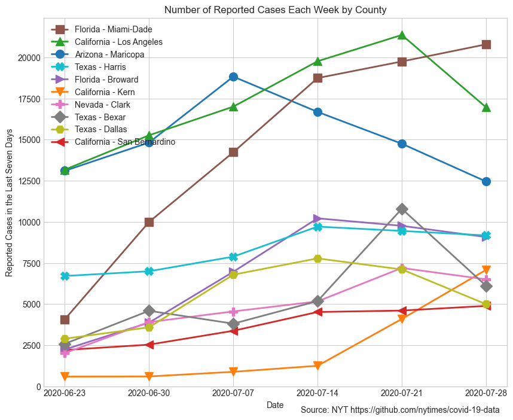
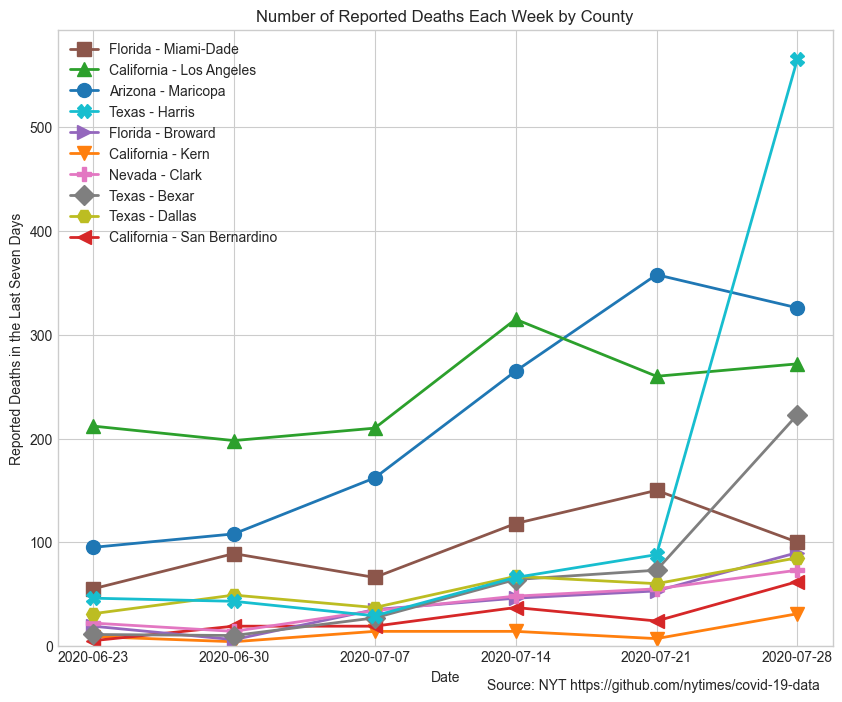

# Coronavirus (Covid-19) in the U.S.

## Cases and Deaths by State

These plots show the number of reported Covid-19 cases and deaths for the ten states with the highest counts, excluding New York. 

## County-Level Cases and Deaths

These plots show the number of reported Covid-19 cases and deaths for the ten counties with the highest counts, excluding New York City and King County, WA. 

## Source

These plots are based on data from The New York Times: https://github.com/nytimes/covid-19-data
