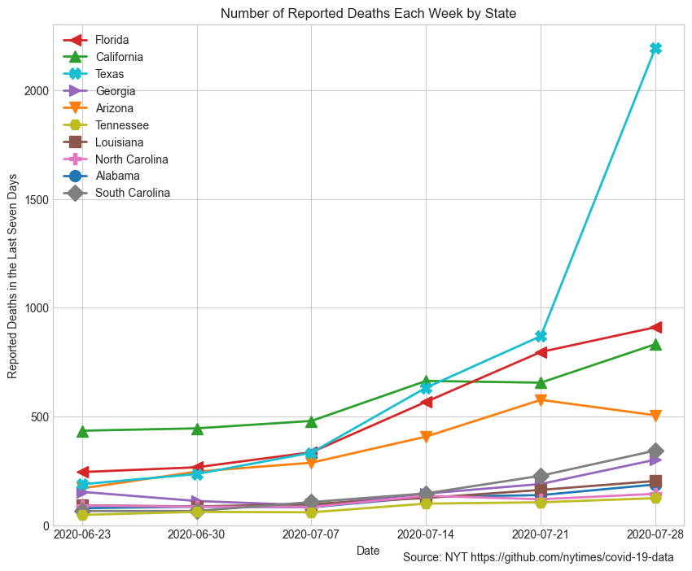

# Coronavirus in the U.S.

Updated with 5/25 data

## Counties with the most deaths

This plot shows the weekly number of reported Covid-19 deaths for the ten counties with the highest counts, excluding New York City. 

## States with the most deaths

This plot shows the weekly number of reported Covid-19 deaths for the ten states with the highest counts. 

## Reported cases by county

This plot shows the number of reported Covid-19 cases for the ten counties with the most deaths, excluding New York City. 

## Reported cases by state

This plot shows the number of reported Covid-19 cases for the ten states with the most deaths. 

## Source

These plots are based on data from The New York Times: https://github.com/nytimes/covid-19-data

Cases with "Unknown" counties are excluded from the county-level plots. These are cases where the patients residence is not known yet. 
