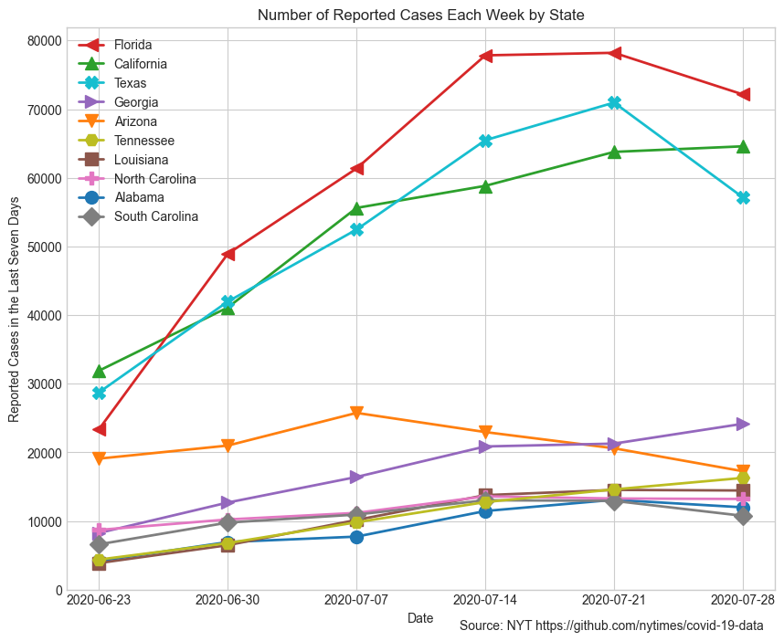

# Coronavirus in the U.S.

The plots below show the ten states and ten counties with the most reported cases of Covid-19 in the last seven days, as of June 12, 2020. 

## Reported cases by state

## Reported cases by county

## Reported deaths by state

## Reported deaths by county

## Source

These plots are based on data from The New York Times: https://github.com/nytimes/covid-19-data

Cases with "Unknown" counties are excluded from the county-level plots. These are cases where the patients residence is not known yet. 
